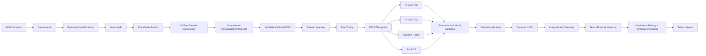
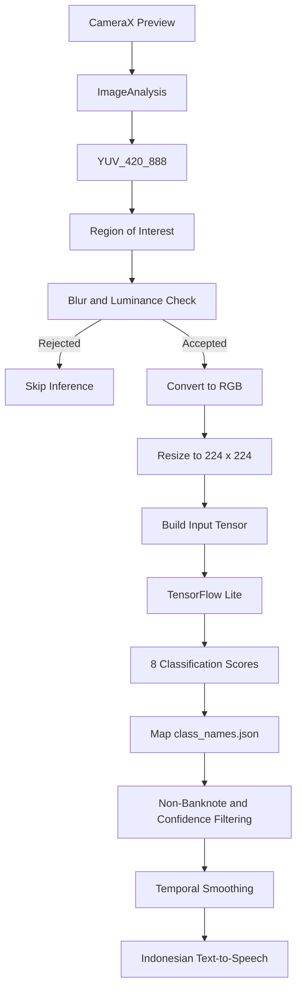

# Indonesian Rupiah Banknote Denomination Recognition Using MobileNetV3-Small on Android

> **Undergraduate Thesis Project — Informatics Engineering, Universitas Brawijaya**  
> Development of an Android-based Indonesian Rupiah banknote denomination recognition application using **MobileNetV3-Small** for visually impaired users.


## About the Project

This repository contains the implementation of an undergraduate thesis project that develops an Android-based system for recognizing Indonesian Rupiah banknote denominations using **MobileNetV3-Small**.

The system is designed to recognize **one banknote at a time** inside a camera *Region of Interest (ROI)*, perform inference **locally and offline**, suppress predictions that do not satisfy quality or stability requirements, and announce the recognized denomination through **Text-to-Speech (TTS)**.

The classification space consists of **8 classes**:

| Class Index | Class |
|---:|---|
| 0 | IDR 1,000 |
| 1 | IDR 2,000 |
| 2 | IDR 5,000 |
| 3 | IDR 10,000 |
| 4 | IDR 20,000 |
| 5 | IDR 50,000 |
| 6 | IDR 100,000 |
| 7 | Non-banknote |

The banknotes covered in this research are Indonesian Rupiah banknotes from the **2016 and 2022 Emission Years**. Emission year and banknote side are not treated as output classes.

---

## Research Objectives

This project aims to:

1. Design and implement an Android application based on MobileNetV3-Small that can recognize one Indonesian Rupiah banknote inside a Region of Interest, operate offline, and provide the recognition result through audio output.
2. Analyze and compare the classification performance of four TensorFlow Lite candidates:
   - FP32
   - FP16
   - Dynamic Range Quantization
   - Full INT8 Quantization
3. Analyze and compare model efficiency based on model size, inference time, and memory usage on Android devices.
4. Evaluate the integrated application under variations of emission year, banknote side, physical condition, capture distance, lighting condition, and non-banknote inputs.

---

## System Overview



---

## Dataset

The research dataset was built from multiple public sources and transformed into an eight-class image classification dataset.

### Data Sources

- **10 Indonesian Rupiah banknote datasets** obtained from Roboflow Universe in COCO annotation format.
- **1 non-banknote candidate dataset source** based on Microsoft COCO 2017 obtained through Kaggle.

The complete raw datasets are not included in this repository due to their large size and because each third-party dataset remains subject to its original source and license.

Only representative sample files and relevant artifacts are included to demonstrate the dataset structure and processing pipeline.

---

## Data Preparation Pipeline

### 1. Banknote Dataset Merging

Script:

```bash
python 00_prepare_merge_dataset.py
```

This stage performs:

- category inventory across source datasets;
- denomination label normalization;
- COCO metadata merging;
- source-aware image renaming;
- generation of `all_data_merged.json`.

The denomination labels are normalized into seven target classes:

`1000`, `2000`, `5000`, `10000`, `20000`, `50000`, and `100000`.

---

### 2. Dataset Audit

Script:

```bash
python 01_audit_dataset.py
```

The audit checks:

- image availability;
- image-annotation relationships;
- bounding box validity;
- annotations without source images;
- images without annotations;
- bounding boxes extending beyond image boundaries.

Audit summary:

| Component | Count |
|---|---:|
| Banknote images in COCO metadata | 40,344 |
| Banknote object annotations | 40,062 |
| Non-banknote candidate images | 8,000 |
| Images without annotations | 1,785 |
| Images with one annotation | 37,629 |
| Images with multiple annotations | 930 |
| Bounding boxes crossing image boundaries | 1,992 |

---

### 3. Banknote Area Extraction

Script:

```bash
python 02_extract_money.py
```

Each COCO annotation is used to generate one classification image.

Main results:

- **40,062** annotations were successfully extracted;
- outputs are stored as **RGB PNG** files;
- no resize is applied during extraction;
- resizing to `224 x 224` is performed when images are loaded during model development;
- source, image, and annotation identities are preserved in the output filenames.

---

### 4. Visual Audit

Scripts:

```bash
python 03_prepare_visual_audit.py
python 03b_visual_audit.py
```

Visual audit candidates are selected using a combination of:

- automatic indicators;
- aspect-ratio outliers;
- relative object-area outliers;
- clipping ratio;
- random sampling per class.

Visual audit results:

| Decision | Count |
|---|---:|
| Audit candidates | 3,463 |
| Valid | 3,348 |
| Excluded | 115 |
| Remaining review items | 0 |

Manual inspection covered approximately **8.64%** of the extracted samples.

---

### 5. Exact Deduplication

Script:

```bash
python 04_exact_dedup.py
```

Exact deduplication uses **SHA-256** calculated from image dimensions and RGB pixel values.

This stage detects only images that are identical at the pixel representation level. It does not perform perceptual similarity matching.

Results:

| Component | Count |
|---|---:|
| Banknote candidates before deduplication | 39,947 |
| Exact duplicate copies removed | 1,365 |
| Banknote samples after deduplication | 38,582 |
| Cross-label hash conflicts | 0 |

---

### 6. Distribution Analysis and Dataset Construction

Scripts:

```bash
python 05a_analyze_distribution.py
python 05b_build_dataset.py
```

The median sample count across the seven banknote classes is **5,184**, which is used as the target size for the non-banknote class.

Final dataset composition:

| Class | Samples |
|---|---:|
| IDR 1,000 | 6,327 |
| IDR 2,000 | 5,184 |
| IDR 5,000 | 4,698 |
| IDR 10,000 | 5,395 |
| IDR 20,000 | 7,781 |
| IDR 50,000 | 4,412 |
| IDR 100,000 | 4,785 |
| Non-banknote | 5,184 |
| **Total** | **43,766** |

---

### 7. Dataset Splitting

Script:

```bash
python 05c_split_dataset.py
```

Target split:

- **80%** training
- **10%** validation
- **10%** testing

For banknote samples, crops originating from the **same source image are assigned to the same partition**. This prevents known source-image groups from being distributed across training, validation, and testing partitions.

Final split:

| Partition | Samples | Proportion |
|---|---:|---:|
| Training | 35,012 | 79.9982% |
| Validation | 4,378 | 10.0032% |
| Testing | 4,376 | 9.9986% |
| **Total** | **43,766** | **100%** |

Verification result:

```text
parent_groups_cross_split = 0
related_samples_cross_split = 0
```

Therefore, no known source-image groups are distributed across multiple partitions.

---

## MobileNetV3-Small

The base model uses **MobileNetV3-Small** initialized with ImageNet pretrained weights.

Main configuration:

| Parameter | Configuration |
|---|---|
| Backbone | MobileNetV3-Small |
| Initial weights | ImageNet |
| Input | 224 x 224 x 3 RGB |
| `include_top` | `False` |
| `alpha` | `1.0` |
| `minimalistic` | `False` |
| `include_preprocessing` | `True` |
| Pooling | GlobalAveragePooling2D |
| Dropout | 0.20 |
| Output | Dense(8) |
| Activation | Softmax |
| Base representation | FP32 |

The model is developed in two phases:

1. **Classification Head Training**  
   The MobileNetV3-Small backbone is frozen while the classification head is trained.

2. **Fine-Tuning**  
   A portion of the upper backbone layers is unfrozen to adapt higher-level representations to Indonesian Rupiah banknotes.

The evaluated fine-tuning depth candidates are:

- top 20% of layers;
- top 35% of layers;
- top 50% of layers.

---

## TensorFlow Lite Optimization

A single MobileNetV3-Small FP32 checkpoint is used as the common source for four TensorFlow Lite candidates.

| Candidate | Input | Output | Calibration |
|---|---|---|---|
| FP32 | float32 | float32 | No |
| FP16 | float32 | float32 | No |
| Dynamic Range | float32 | float32 | No |
| Full INT8 | int8 | int8 | Yes |

This design ensures that differences among candidates are caused by numerical representation and conversion strategy rather than by different base models.

Model selection considers:

- accuracy;
- precision;
- recall;
- macro F1-score;
- weighted F1-score;
- confusion matrix;
- model size;
- median inference time;
- P95 inference time;
- memory usage.

The selected model is not determined solely by the smallest model size or fastest inference time. Classification quality must also remain acceptable.

---

## Android Inference Pipeline

The Android application is designed to perform all inference locally.



Main components:

- **CameraX** for camera preview and frame analysis;
- **Region of Interest (ROI)** for positioning one banknote;
- image quality checking using luminance and sharpness information;
- RGB input resized to `224 x 224`;
- **TensorFlow Lite/LiteRT** for on-device inference;
- a **non-banknote** class to help reject out-of-scope objects;
- confidence thresholding;
- temporal smoothing;
- Indonesian **Text-to-Speech**;
- fully **offline** primary recognition functionality.

CLAHE is designed as a conditional transformation rather than an always-on preprocessing step.

---

## Evaluation

### Model Evaluation

Classification metrics include:

- Accuracy
- Precision
- Recall
- F1-score
- Macro F1-score
- Weighted F1-score
- Confusion Matrix

### Efficiency Evaluation

Efficiency measurements include:

- model file size;
- inference time;
- memory usage.

### Android System Evaluation

The system is designed to be evaluated under:

- **10 cm**, **20 cm**, and **30 cm** capture distances;
- **low**, **normal**, and **bright** lighting;
- **normal**, **worn**, and **folded** banknote conditions;
- 2016 and 2022 emission-year banknotes;
- front and back sides;
- non-banknote objects.

The physical Android devices specified for technical evaluation are:

- **POCO X5 Pro 5G**
- **Xiaomi Redmi 4X**

---

## Repository Structure

General repository structure:

```text
.
├── persiapan_data/
│   ├── raw_dataset/
│   ├── 02_extracted/
│   └── ...
│
├── pengembangan_model/
│   └── ...
│
├── scripts/
│   ├── ...
│   └── pengembangan_model/
│       └── android-benchmark/
│
├── .gitignore
├── README.md
└── tree.json
```

> Large datasets and selected large research artifacts are intentionally excluded from GitHub. The repository contains representative samples, source code, metadata, configuration files, and relevant artifacts required to understand the research pipeline.

---

## Reproduction

Make sure Python and the required project dependencies are configured before running the pipeline.

General dataset preparation order:

```text
00_prepare_merge_dataset.py
        ↓
01_audit_dataset.py
        ↓
02_extract_money.py
        ↓
03_prepare_visual_audit.py
        ↓
03b_visual_audit.py
        ↓
04_exact_dedup.py
        ↓
05a_analyze_distribution.py
        ↓
05b_build_dataset.py
        ↓
05c_split_dataset.py
```

Some research scripts may contain local filesystem configuration. When reproducing the project on another machine, adjust dataset and output paths to match the local environment.

---

## System Limitations

This project is not intended to:

- recognize coins;
- detect counterfeit banknotes;
- read banknote serial numbers;
- determine circulation fitness;
- recognize multiple banknotes simultaneously;
- classify emission year or banknote side as output classes;
- replace large-scale usability evaluation with visually impaired users.

The research focuses on the technical development and evaluation of an Indonesian Rupiah banknote denomination recognition system on Android devices.

---

## Dataset Availability in This Repository

Because the research dataset is large, the complete raw dataset and all extracted images are not stored in this repository.

Selected sample files are included to demonstrate:

- source image format;
- annotation format;
- extraction results;
- dataset structure;
- metadata and manifest formats.

To fully reproduce the dataset, the original public datasets must be obtained from the sources documented in the research while complying with each source's licensing terms.

---

## Author

**Aracel Nestova Aprilyanto**  
Informatics Engineering  
Faculty of Computer Science  
Universitas Brawijaya

Undergraduate thesis:

> **Development of an Indonesian Rupiah Banknote Denomination Recognition Application Based on MobileNetV3-Small on Android Devices for Visually Impaired Users**

Supervisors:

- Fais Al Huda, S.Kom., M.Kom.
- Dr. Eng. Novanto Yudistira, S.Kom., M.Sc.

---

## Academic Notice

This repository was developed as part of an academic research project. Third-party datasets remain subject to the licenses and terms of their original sources.

If you use the code, methodology, or research outputs from this project for academic purposes, please provide appropriate attribution to the research and the corresponding dataset sources.
