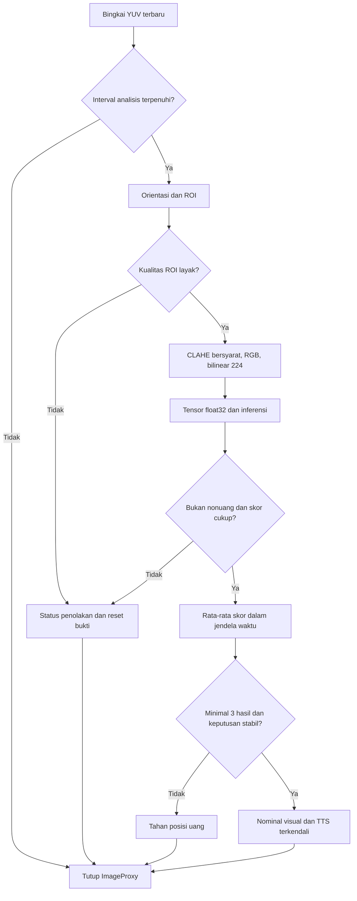

# Struktur aplikasi dan alur operasional

Satu modul Gradle `app` dengan paket berdasarkan tanggung jawab. Pemisahan dibuat di tingkat kelas/paket sehingga tidak menambah banyak modul build untuk aplikasi kecil.

| Paket / kelas | Tugas |
|---|---|
| `ui/MainActivity` | Izin kamera, tombol, status, nominal, siklus Activity |
| `ui/RoiOverlay` | Menggambar panduan ROI yang tidak menerima fokus TalkBack |
| `session/RecognitionSession` | Menghubungkan komponen, mengelola satu worker dan identitas sesi kamera |
| `camera/CameraController` | Preview, ImageAnalysis, shared ViewPort, pergantian kamera |
| `image/RoiGeometry` | Satu rumus ROI untuk overlay dan citra analisis |
| `image/YuvRoi` | Membaca YUV dengan crop, rotasi, rowStride, dan pixelStride |
| `image/QualityGate` | Rata-rata Y dan varians Laplacian pada ROI asli |
| `image/LuminanceClahe` | CLAHE opsional pada luminansi saja |
| `image/FramePreprocessor` | Buffer ROI, YUV→RGB, resize bilinear, float32 input |
| `inference/ModelRunner` | Integritas aset, pemuatan satu interpreter, validasi kontrak, inferensi |
| `prediction/TemporalDecision` | Penolakan, rata-rata vektor skor berbasis waktu, aturan pengulangan |
| `speech/SpeechOutput` | Voice Indonesia luring, QUEUE_FLUSH, callback audio, shutdown |
| `config/AppConfig` | Membaca dan memvalidasi parameter lokal |
| `logging/EventLog` | Log teknis JSONL lokal terbatas ukurannya |

## Pipeline

## Kamera dan ROI

CameraX menjalankan Preview dan ImageAnalysis dari kamera yang sama dalam satu `UseCaseGroup` dengan `PreviewView.viewPort`. Preview memakai `FILL_CENTER`. ROI pusat dihitung pada ukuran pratinjau dan pada crop analisis yang telah dikoreksi orientasinya. Rumus mempertahankan lebar proporsional dan aspek ROI; apabila tinggi tidak cukup, ROI diperkecil agar tetap di dalam pratinjau.

Kamera depan menampilkan pratinjau seperti cermin sebagaimana perilaku PreviewView, tetapi tensor menggunakan citra berorientasi benar tanpa membalik objek secara horizontal. Karena ROI selalu simetris di pusat, pencerminan tidak mengubah wilayah fisik yang dipotong. Bila kelak ROI dapat digeser atau tidak lagi di tengah, pemetaan ini harus diganti dengan transformasi koordinat eksplisit.

Resolusi yang diminta 640×480 dengan fallback; hasil negosiasi CameraX tidak dijamin tepat sama pada semua perangkat. Pembacaan menggunakan ukuran dan stride aktual, bukan asumsi buffer rapat. Pada pergantian kamera, token sesi berubah sebelum bind, sehingga hasil lama yang sedang diproses tidak dapat masuk UI/TTS kamera baru. Interpreter dan TTS dipertahankan selama pergantian tersebut. Jika kamera tujuan gagal, controller mencoba mengikat kembali kamera sebelumnya. Kegagalan kamera pemulihan menghentikan sesi dengan status yang dapat ditindaklanjuti.

## Praproses

1. Throttle diterapkan sebelum pekerjaan piksel, batas awal 3 analisis per detik.
2. Kanal Y ROI disalin ke buffer yang dipakai ulang. Varians Laplacian menggunakan tetangga atas, bawah, kiri, kanan, piksel interior, dan varians populasi. Rata-rata Y menggunakan seluruh piksel ROI.
3. Citra buram atau terlalu terang ditahan. Citra redup ditahan jika CLAHE mati; bila kelak CLAHE dipilih lewat kalibrasi, citra redup yang lolos blur dapat ditingkatkan pada kanal Y.
4. U dan V dipertahankan. Konversi awal memakai BT.601 limited range; pilihan `full_bt601` tersedia sebagai konfigurasi eksplisit. Format `YUV_420_888` tidak sendirinya menjamin matriks/rentang warna semua vendor. Kesetaraan kamera tetap harus diperiksa pada tahap integrasi perangkat berikutnya.
5. RGB ROI di-clamp ke `[0,255]`, lalu di-resize dengan koordinat half-pixel dan bilinear float. Tidak memakai JPEG/Bitmap, normalisasi tambahan, antialias, atau padding letterbox.
6. Buffer masukan `[1,224,224,3]` berisi float32 urutan RGB. Model telah memiliki rescaling dan softmax internal.

Implementasi CLAHE ringan ini menggunakan histogram 256 bin per tile, clip limit relatif terhadap luas tile, redistribusi kelebihan histogram, CDF, dan interpolasi antartile. Detail batas tile bukan klaim identik bit demi bit dengan OpenCV. Jika kalibrasi memakai CLAHE, gunakan implementasi aplikasi yang sama, resolusi yang sama, dan konfigurasi yang sama. Jangan menyalin ambang dari pipeline lain.

## Pascainferensi dan TTS

`TemporalDecision` menyimpan salinan **delapan skor** dari prediksi yang lolos, beserta waktu monotonic. Skor lama di luar W dibuang. Penolakan kualitas/nonuang/keyakinan mengosongkan bukti temporal agar prediksi lama tidak bocor ke objek berikutnya. Pengumuman terakhir tidak langsung dilupakan hanya karena satu bingkai ditolak.

Keputusan membutuhkan minimal tiga hasil yang masih dalam W, rata-rata pemenang melewati threshold, dan pemenang terbaru sama dengan pemenang rata-rata. Syarat terakhir adalah tambahan konservatif untuk menahan pengumuman nominal lama saat objek berganti. W merupakan panjang jendela geser, bukan kewajiban menunggu tepat W sejak hasil pertama; spesifikasi skripsi mensyaratkan minimal tiga hasil dalam jendela.

Nominal yang sama tidak diucapkan kembali selama tetap valid. Setelah penolakan beruntun minimal W, nominal sama dapat diumumkan lagi. Jeda tanpa observasi melebihi W membuang bukti, tetapi tidak dianggap sebagai bukti nonuang yang sengaja diobservasi.

Suara status kamera hanya diberikan pada peristiwa aktivasi/pergantian. Status blur/redup/belum stabil tetap berupa teks yang bisa dibaca TalkBack. Tidak ada live-region agresif per bingkai yang bersaing dengan suara nominal. Tombol memiliki label semantik dan tinggi minimal 56 dp. Jika suara Indonesia luring tidak tersedia, sesi ditahan dengan petunjuk pemasangan; aplikasi tidak diam-diam memakai suara jaringan.

## Pengelolaan sumber daya

Satu executor menjalankan persiapan tensor, inferensi, dan penutupan interpreter secara berurutan. `ImageProxy.close()` selalu berada di `finally`, termasuk bingkai yang dilewati. `KEEP_ONLY_LATEST` membatasi antrean. Kamera dan TTS dihentikan pada stop/background. Penutupan model diantrekan setelah inferensi yang masih berlangsung, bukan dilakukan bersamaan dari UI thread. Seluruh callback hasil memeriksa identitas sesi sebelum mengubah layar.

Log berada di direktori internal aplikasi, maksimum sekitar dua berkas 1 MiB, tanpa gambar dan tanpa izin penyimpanan. Ringkasan bingkai dibatasi sekitar satu kali per detik. Ini log diagnostik, **bukan** pencatat seluruh urutan kalibrasi atau alat ukur latensi end-to-end penelitian. `log_enabled=false` dapat dipakai nanti setelah konfigurasi final diputuskan dan dicatat.
